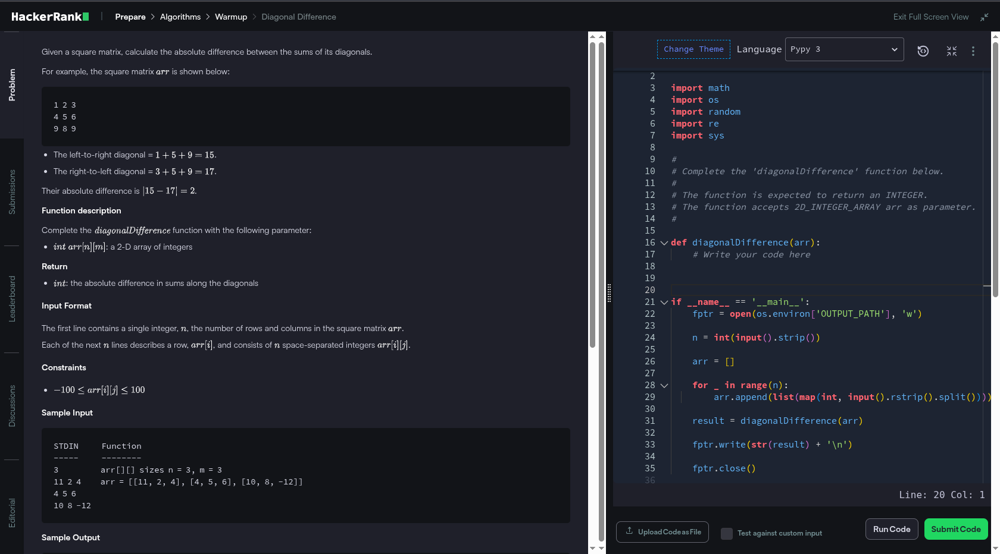

# diagonal Difference - HackerRank.com


## Problem Short Description
Given a square matrix, calculate the absolute difference between the sums of its diagonals.

## Problem Link

[HackerRank – diagonal Difference](https://www.hackerrank.com/challenges/diagonal-difference)


## Solution


## How to Run

```bash
python optimized_solution.py
```
## Authors

- [@ZeyadGabr1](https://www.github.com/ZeyadGabr1)

